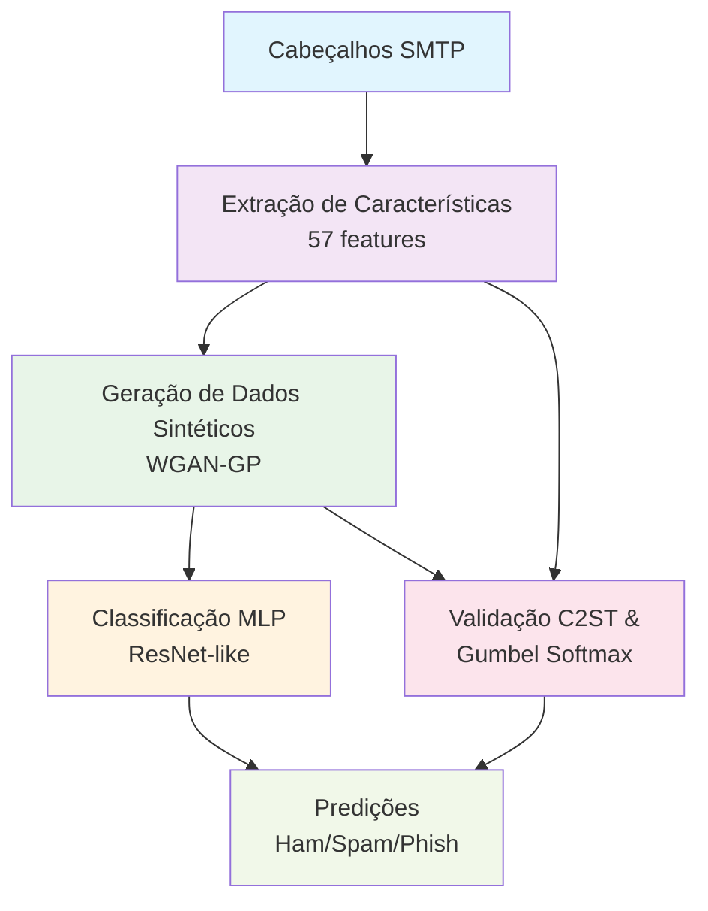

# Uma Nova Abordagem para Detecção de Cabeçalhos SMTP Falsos usando Aprendizado Profundo e Geração de Dados Sintéticos

[](https://www.python.org/downloads/)
[](https://pytorch.org/)
[](LICENSE)

## Sumário

- [Visão Geral](#visão-geral)
- [Abstract](#abstract)
- [Arquitetura do Sistema](#arquitetura-do-sistema)
- [Requisitos](#requisitos)
- [Instalação](#instalação)
- [Configuração](#configuração)
- [Uso](#uso)
- [Estrutura do Projeto](#estrutura-do-projeto)
- [Metodologia](#metodologia)
- [Avaliação](#avaliação)
- [Resultados](#resultados)

## Visão Geral

Este projeto implementa uma abordagem inovadora para detecção de cabeçalhos SMTP falsificados em e-mails, combinando técnicas de aprendizado profundo com geração de dados sintéticos. O sistema é capaz de classificar e-mails em três categorias: **ham** (legítimos), **spam** e **phishing**, utilizando análise de cabeçalhos SMTP.

## Abstract

Este trabalho propõe uma nova abordagem para a detecção de cabeçalhos de e-mail anômalos, com foco em mensagens de phishing, spam e legítimas. Utilizamos um **Perceptron Multicamadas (MLP)** para classificação e uma **Rede Adversária Generativa com Gradiente Penalizado (WGAN-GP)** para geração de dados sintéticos. A técnica **Gumbel Softmax** é empregada para simular características de conjuntos de dados desbalanceados, e os dados gerados são avaliados por testes estatísticos. O **Ray Tune** é utilizado para otimização dos hiperparâmetros do modelo. Os resultados demonstram que a abordagem proposta melhora a acurácia e a capacidade de generalização na detecção de ameaças em cabeçalhos de e-mail.

## Arquitetura do Sistema



## Requisitos

### Sistema

- Python 3.8+
- CUDA (opcional, para aceleração GPU)
- 8 GB+ de RAM recomendado.

### Dependências Principais

- `torch==2.5.1` - Framework de deep learning.
- `numpy==2.2.2` - Computação numérica.
- `ray==2.41.0` - Otimização distribuída de hiperparâmetros.
- `matplotlib==3.10.0`  - Visualização de dados.

## Instalação

1. **Clone o repositório:**

    ```bash
    git clone <url-do-repositorio>
    cd TCC
    ```

2. **Crie um ambiente virtual:**

    ```bash
    python -m venv venv
    source venv/bin/activate  # Linux/Mac
    # ou
    venv\Scripts\activate     # Windows
    ```

3. **Instale as dependências:**

    ```bash
    pip install -r requirements.txt
    ```

4. **Configure os diretórios:**

    ```bash
    python config.py
    ```

## Configuração

### Configuração Principal (`config.py`)

O arquivo `config.py` contém todas as configurações do sistema:

```python
# Escolha do tipo de classificação
ONE_CLASS = "spam"  # ou "phishing"

# Configurações de hardware
DEVICE = torch.device("cuda" if torch.cuda.is_available() else "cpu")
NUM_WORKERS = min(8, multiprocessing.cpu_count())

# Hiperparâmetros da GAN
LATENT_DIM = 1024
NUM_EPOCHS_GAN = 3000
LR_GAN = [0.0002, 0.0002]
GEN_TEMPERATURE = 0.4  # Para Gumbel Softmax
```

### Características Extraídas

O sistema extrai **57 características** dos cabeçalhos SMTP, incluindo:

- **Características temporais**: `time_zone`, `date_comp_date_received`
- **Campos ausentes**: `missing_mime-version`, `missing_x-mailer`, etc.
- **Análise de strings**: `str_content-encoding_empty`, `str_from_question`, etc.
- **Validação de domínios**: `domain_match_message-id_from`, etc.
- **Verificação de autenticidade**: `received_str_forged`, `email_match_from_reply-to`

### Dados e Cache

O projeto utiliza um sistema de cache inteligente que armazena as características processadas em arquivos `.pkl` no diretório `cache/`. Isso acelera significativamente execuções subsequentes.

#### Datasets Incluídos

O projeto já inclui dados processados em cache. Para trabalhar com dados originais ou adicionar novos datasets:

#### Dados de Phishing

Para baixar novos dados de phishing:

1. Acesse: [https://monkey.org/~jose/phishing/](https://monkey.org/~jose/phishing/)
2. Baixe os arquivos TXT (phishing-20XX)
3. Extraia em: `Dataset/Phishing/TXTs/`

#### Dados de Spam/Ham

Para o dataset TREC07:

1. Acesse: [https://plg.uwaterloo.ca/~gvcormac/treccorpus07/](https://plg.uwaterloo.ca/~gvcormac/treccorpus07/)
2. Baixe e extraia em: `Dataset/SpamHam/`

**Nota**: Após adicionar novos dados, delete os arquivos de cache em `cache/` para forçar o reprocessamento com os novos datasets.

## Uso

### Execução Principal

```bash
python main.py
```

### Configuração para Spam vs Ham

```bash
# Edite config.py
ONE_CLASS = "spam"
python main.py
```

### Configuração para Phishing vs Ham

```bash
# Edite config.py
ONE_CLASS = "phishing"
python main.py
```

### Fluxo de Execução

1. **Carregamento dos dados** - Extração de características dos e-mails
2. **Identificação da classe minoritária** - Análise do desbalanceamento
3. **Treinamento da WGAN-GP** - Geração de dados sintéticos
4. **Validação C2ST** - Teste estatístico dos dados gerados
5. **Otimização de hiperparâmetros** - Ray Tune para MLP
6. **Treinamento comparativo** - Modelo original vs. aumentado
7. **Avaliação final** - Métricas e visualizações

## Estrutura do Projeto

```text
TCC/
├── main.py                # Script principal de execução
├── config.py              # Configurações globais
├── requirements.txt       # Dependências Python
├── 
├── Modelos
│   ├── mlp.py             # Implementação do MLP com ResNet blocks
│   ├── gan.py             # WGAN-GP com Gumbel Softmax
│   └── c2st.py            # Classifier Two-Sample Test
├── 
├── Processamento
│   ├── dataExtractor.py   # Extração de características
│   ├── dataOrganizer.py   # Organização dos datasets
│   ├── receivedParser.py  # Análise de cabeçalhos Received
│   └── rayParam.py        # Otimização com Ray Tune
├── 
├── Visualização
│   └── plot.py            # Gráficos e visualizações
├── 
├── Dados
│   ├── Dataset/           # Datasets originais
│   │   ├── data/          # Dados processados
│   │   ├── example/       # Exemplos de teste
│   │   ├── Phishing/      # Datasets de phishing
│   │   └── SpamHam/       # Datasets spam/ham
│   ├── cache/             # Cache de características
│   ├── checkpoints/       # Checkpoints dos modelos
│   └── plots/             # Gráficos gerados
└── 
```

## Metodologia

### 1. Extração de Características

- Análise de 57 características dos cabeçalhos SMTP
- Cache inteligente para otimização de performance
- Processamento paralelo para grandes datasets

### 2. WGAN-GP com Gumbel Softmax

## Características principais da GAN

- Generator com ResidualBlocks
- Discriminator com Gradient Penalty
- Gumbel Softmax para características categóricas
- Temperature annealing para estabilidade

### 3. Validação Estatística

- **Classifier Two-Sample Test (C2ST)** para validar qualidade dos dados sintéticos
- **Maximum Mean Discrepancy (MMD)** para medir divergência
- **Testes de permutação** para p-values

### 4. Classificação MLP

## Arquitetura do MLP

- Input Layer: 57 características
- Residual Blocks: 2 camadas com skip connections
- Regularização: L1, L2, Dropout
- Output: 2 classes (ham vs spam/phishing)

### 5. Otimização de Hiperparâmetros

- **Ray Tune** para busca automática
- **Validação cruzada** estratificada
- **Early stopping** para evitar overfitting

## Avaliação

### Métricas Utilizadas

- **Acurácia**: Precisão geral do modelo
- **Precisão por classe**: Ham, Spam, Phishing
- **Recall por classe**: Taxa de detecção
- **F1-Score**: Média harmônica entre precisão e recall
- **Matriz de Confusão**: Análise detalhada de erros

### Validação dos Dados Sintéticos

- **C2ST Accuracy**: < 60% indica dados sintéticos de qualidade
- **P-value**: > 0.05 sugere similaridade estatística
- **MMD**: Distância entre distribuições reais e sintéticas

## Resultados

### Exemplo de Output

```text
Distribuição das classes:
Classe 0 (ham): 2500 amostras
Classe 1 (spam): 800 amostras
Classe minoritária: 1
Amostras necessárias para balanceamento: 1700

Resultados do Classifier Two-Sample Test (C2ST):
Acurácia do C2ST: 52.30%
Maximum Mean Discrepancy: 0.0234
P-valor: 0.1245
Os dados gerados são similares aos reais

Comparison of results:
Accuracy with GAN-augmented data: 94.50%
Accuracy without GAN-augmented data: 89.20%
Accuracy gain: 5.30%
```

### Visualizações Geradas

- Curvas de treinamento do MLP
- Perdas da GAN durante treinamento
- Distribuição de características (original vs sintético)
- Matrizes de confusão
- Resultados do Ray Tune

---

## Licença

Este projeto está licenciado sob a Licença MIT - veja o arquivo [LICENSE](LICENSE) para detalhes.
